# Course structure
<section data-state="slide1">

 "Fitting functions"

\n

 "Registration"

 "Segmentation"

</section>

# Voxel-based segmentation
<section data-state="slide2">

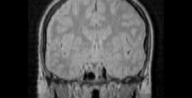

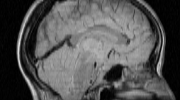

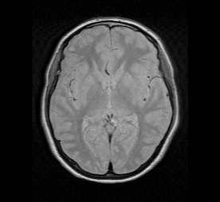

Determine to which anatomical structure each voxel in the image belongs:

- Think "LEGO bricks"
- Outer surfaces can easily be extracted if needed

</section>

# Voxel-based segmentation
<section data-state="slide3">

 Automated computational methods 

&#x21e8;

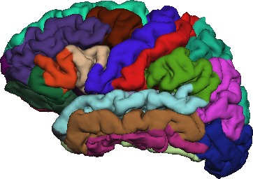

</section>

# This week and next week

 Automated computational methods 

&#x21e8;

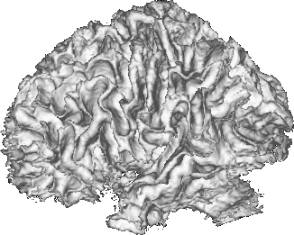
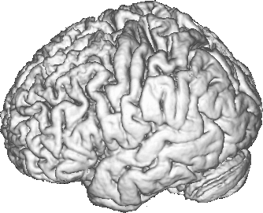

# The problem to be solved

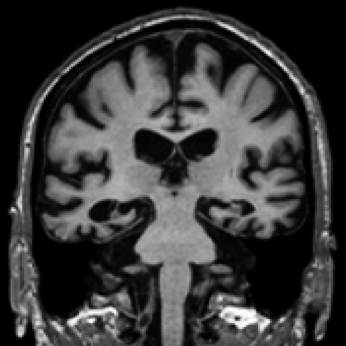

MRI image $\mathbf{d}$ 

$N$ voxels   
$\mathbf{d} = (d_1,\dots,d_N)^T$  
$d_n:$ intensity in voxel $n$ 

&#x21e8;

Label image $\mathbf{l}$ 

$\mathbf{l} = (l_1,\dots,l_N)^T$  
$l_n \in \{1,\dots,K\}$  
$K:$ number of classes 

# One solution: generative modeling
- Formulate a statistical model of how a medical image is formed
 

$p(\mathbf{l}|\boldsymbol{\theta}_l)$

&#x21e8;

"labeling model"

Label image $\mathbf{l}$ 

$p(\mathbf{d}|\mathbf{l}, \boldsymbol{\theta}_d)$

&#x21e8;

"imaging model"

MRI image $\mathbf{d}$ 

 
- The model depends on some parameters $\boldsymbol{\theta} = (\boldsymbol{\theta_{l}}^{T}, \boldsymbol{\theta_{d}}^{T})^T$
- Appropriate values $\boldsymbol{\hat{\theta}}$ are assumed to be known for now...

# Toy example

$N=2$ voxels 

$K=3$ classes 

$\mathbf{l}=\begin{pmatrix}l_1 \\ l_2 \end{pmatrix}$

$\mathbf{d}=\begin{pmatrix}d_1 \\ d_2 \end{pmatrix}$

$p(\mathbf{l}) = p(l_1, l_2)$ 

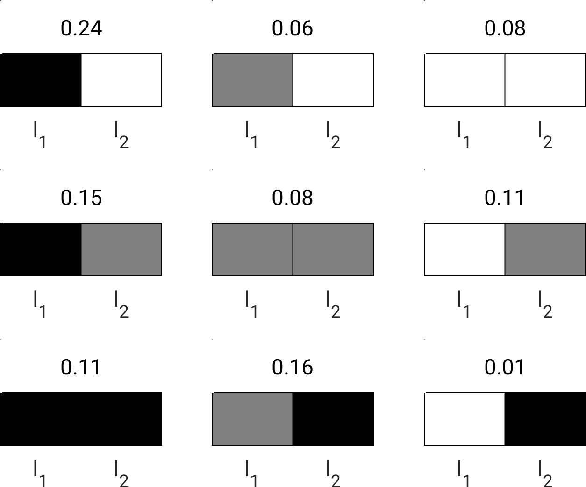

$p(\mathbf{l}) = p(l_1, l_2)$ 

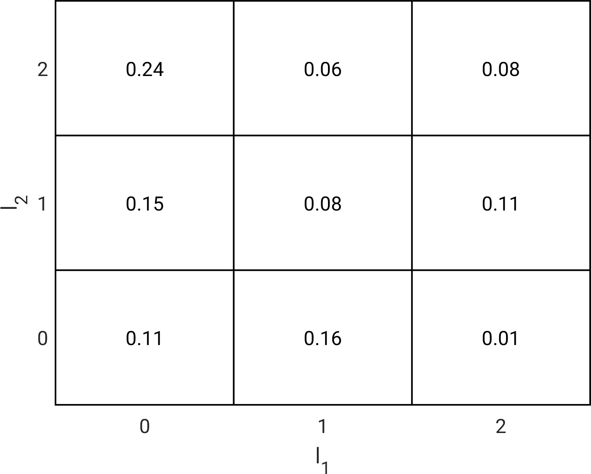

$p(\mathbf{d}|\mathbf{l}) = p(d_1, d_2 | l_1, l_2)$ 

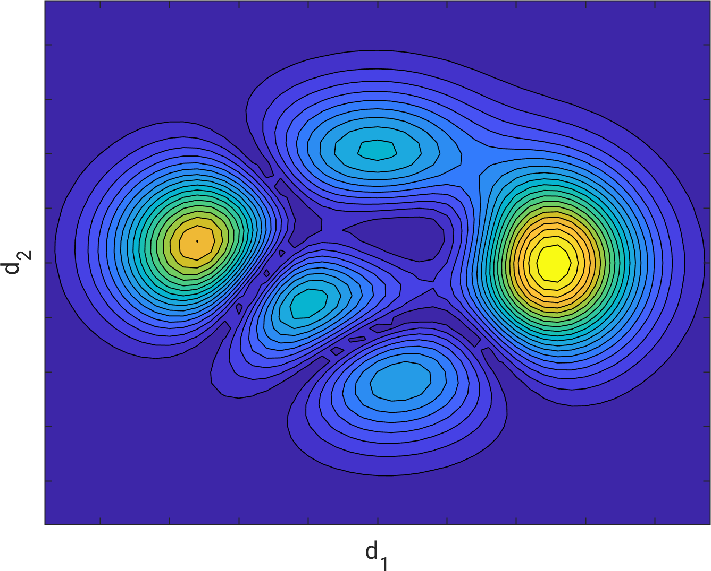

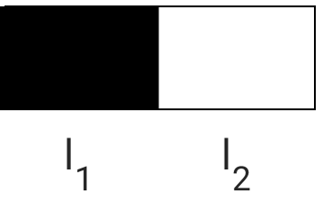

# One solution: generative modeling
- Formulate a statistical model of how a medical image is formed
 

$p(\mathbf{l}|\boldsymbol{\theta}_l)$

&#x21e8;

"labeling model"

Label image $\mathbf{l}$ 

$p(\mathbf{d}|\mathbf{l}, \boldsymbol{\theta}_d)$

&#x21e8;

"imaging model"

MRI image $\mathbf{d}$ 

 
- The model depends on some parameters $\boldsymbol{\theta} = (\boldsymbol{\theta_{l}}^{T}, \boldsymbol{\theta_{d}}^{T})^T$
- Appropriate values $\boldsymbol{\hat{\theta}}$ are assumed to be known for now...

# Segmentation = inverse problem

MRI image $\mathbf{d}$ 

&#x21e8;

Label image $\mathbf{l}$ 

$\mathbf{\hat{l}} = \arg \max_{\mathbf{l}} p(\mathbf{l}|\mathbf{d}, \boldsymbol{\theta})$  

The posterior distribution $p(\mathbf{l}|\mathbf{d}, \boldsymbol{\hat{\theta}})$ is given by Bayes' rule: 

$p(\mathbf{l}|\mathbf{d}, \boldsymbol{\hat{\theta}}) = \frac{p(\mathbf{d}|\mathbf{l}, \boldsymbol{\hat{\theta}_d}) p(\mathbf{l}|\boldsymbol{\hat{\theta}_l})}{p(\mathbf{d}|\boldsymbol{\hat{\theta}})}$

$p(\mathbf{l}|\mathbf{d}, \boldsymbol{\hat{\theta}}) = \frac{p(\mathbf{d}|\mathbf{l}, \boldsymbol{\hat{\theta}_d}) \textcolor{blue}{p(\mathbf{l}|\boldsymbol{\hat{\theta}_l})}}{p(\mathbf{d}|\boldsymbol{\hat{\theta}})}$

$p(\mathbf{l}|\mathbf{d}, \boldsymbol{\hat{\theta}}) = \frac{\textcolor{blue}{p(\mathbf{d}|\mathbf{l}, \boldsymbol{\hat{\theta}_d})} p(\mathbf{l}|\boldsymbol{\hat{\theta}_l})}{p(\mathbf{d}|\boldsymbol{\hat{\theta}})}$

$p(\mathbf{l}|\mathbf{d}, \boldsymbol{\hat{\theta}}) = \frac{p(\mathbf{d}|\mathbf{l}, \boldsymbol{\hat{\theta}_d}) p(\mathbf{l}|\boldsymbol{\hat{\theta}_l})}{\textcolor{blue}{p(\mathbf{d}|\boldsymbol{\hat{\theta}})}}$

 labeling model 

 imaging model 

 $p(\mathbf{d}|\boldsymbol{\hat{\theta}}) = \sum_{\mathbf{l}} p(\mathbf{d}|\mathbf{l}, \boldsymbol{\hat{\theta}_{d}})p(\mathbf{l}|\boldsymbol{\hat{\theta}_l})$  (not needed) 

# Gaussian mixture model

$p(\mathbf{l}|\boldsymbol{\theta}_l)$

&#x21e8;

"labeling model"

Label image $\mathbf{l}$ 

$p(\mathbf{d}|\mathbf{l}, \boldsymbol{\theta}_d)$

&#x21e8;

"imaging model"

MRI image $\mathbf{d}$ 

- Assign a label to each voxel independently
- Probability of assigning label $k$ is $\pi_k$

$p(\mathbf{l} | \boldsymbol{\theta}_l) = \prod_n \pi_{l_n}, \quad \boldsymbol{\theta}_l = (\pi_{1}, \dots, \pi_{K})^T$

# Toy example

$N=2$ voxels 

$K=3$ classes 

$\mathbf{l}=\begin{pmatrix}l_1 \\ l_2 \end{pmatrix}$

$p(\mathbf{l}) = p(l_1, l_2) = p(l_2 | {\color{red}\cancel{{\color{black}l_1}}})p(l_1)$ 

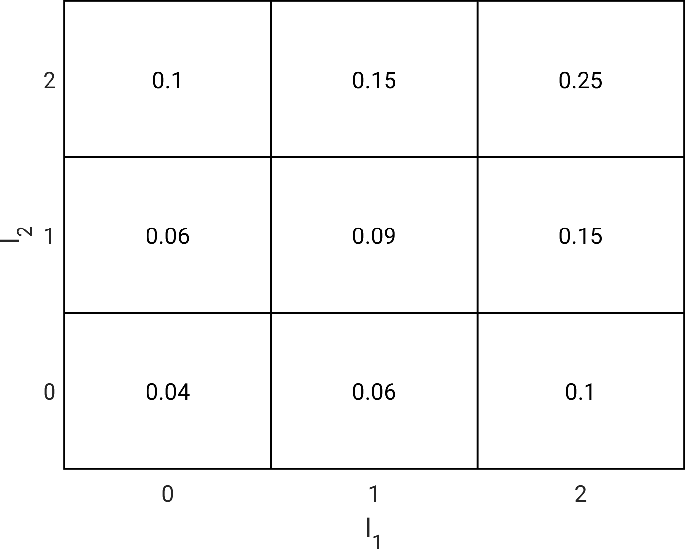

 $=$ 

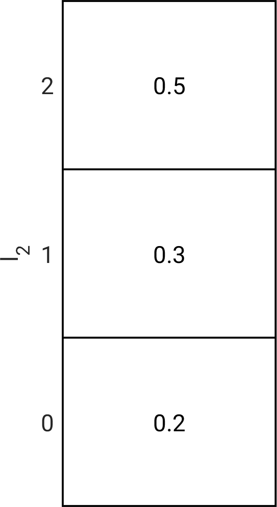

 $\cdot$ 

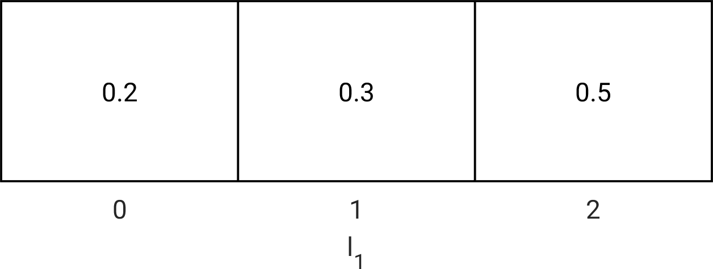

# Gaussian mixture model

$p(\mathbf{l}|\boldsymbol{\theta}_l)$

&#x21e8;

"labeling model"

Label image $\mathbf{l}$ 

$p(\mathbf{d}|\mathbf{l}, \boldsymbol{\theta}_d)$

&#x21e8;

"imaging model"

MRI image $\mathbf{d}$ 

- Draw the intensity in each voxel with label $k$ from a Gaussian distribution with mean $\mu_{k}$ and variance $\sigma_{k}^{2}$

$p(\mathbf{d} | \mathbf{l}, \boldsymbol{\theta}_l) = \prod_n \mathcal{N}(d_{n}|\mu_{{l_{n}}}, \sigma_{l_{n}}^{2}), \quad \boldsymbol{\theta}_d = (\mu_{1}, \dots, \mu_{K},\sigma_{1}^{2}, \dots, \sigma_{K}^{2})^T$

$\mathcal{N}(d|\mu,\sigma^2) = \frac{1}{\sqrt{2\pi\sigma^2}}\exp[-\frac{(d-\mu)^{2}}{2\sigma^{2}}]$

# Toy example

$N=2$ voxels 

$K=3$ classes 

$\mathbf{d}=\begin{pmatrix}d_1 \\ d_2 \end{pmatrix}$

$p(\mathbf{d}|\mathbf{l}) = p(d_1, d_2 | l_1, l_2) = p(d_2 |{\color{red}\cancel{{\color{black}l_1}}}, l_2,  {\color{red}\cancel{{\color{black}d_1}}})p(d_1 | l_1, {\color{red}\cancel{{\color{black}l_2}}})$ 

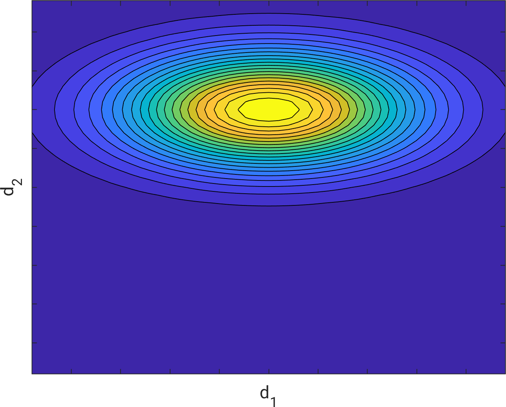

 $=$ 

 $\cdot$ 

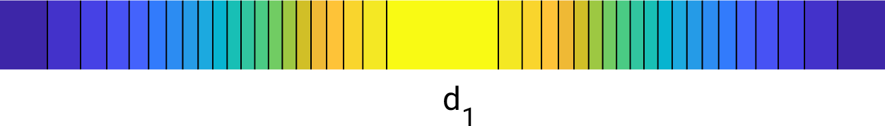

# Gaussian mixture model

$K=3$ labels

 

$p(\mathbf{d}|\boldsymbol{\theta}) = \prod_n(\sum_k\mathcal{N}(d_n|\mu_k,\sigma_k^2)\pi_k)$ 

 

$\boldsymbol{\theta} = (\mu_{1},\dots,\mu_{K},\sigma_{1}^{2},\dots,\sigma_{K}^{2},\pi_{k},\dots,\pi_{K})^T$

# Posterior probability distribution

$\begin{align}
p(\mathbf{l}|\mathbf{d}, \boldsymbol{\hat{\theta}}) &= \frac{p(\mathbf{d}|\mathbf{l},\boldsymbol{\hat{\theta}_{d}}) p(\mathbf{l}|\boldsymbol{\hat{\theta}_{l}})}{p(\mathbf{d}|\boldsymbol{\hat{\theta}})}\\
&=\frac{\prod_n\mathcal{N}(d_n|\hat{\mu}_{l_{n}},\hat{\sigma}_{l_n})^2)\prod_n\hat{\pi}_{l_n}}{\prod_n\sum_k\mathcal{N}(d_n|\hat{\mu}_{k}, \hat{\sigma}_{k}^{2})\hat{\pi}_{k}}\\
&=\prod_n p(l_n|d_n,\boldsymbol{\hat{\theta}})
\end{align}$

$p(l_n|d_n,\boldsymbol{\hat{\theta}}) = \frac{\mathcal{N}(d_{n}|\hat{\mu}_{l_{n}}, \hat{\sigma}_{l_{n}}^{2})\hat{\pi}_{l_{n}}}{\sum_k\mathcal{N}(d_n|\hat{\mu}_{k}, \hat{\sigma}_{k}^{2})\hat{\pi}_{k}}$

# Maximum a posteriori segmentation 
<section data-state="slide4">

$\mathbf{\hat{l}} = \arg\max_{\mathbf{l}}p(\mathbf{l}|\mathbf{d},\boldsymbol{\hat{\theta}}) = \arg\max_{l_1,\dots,l_I}p(l_n|d_n,\boldsymbol{\hat{\theta}})$

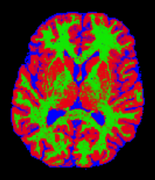
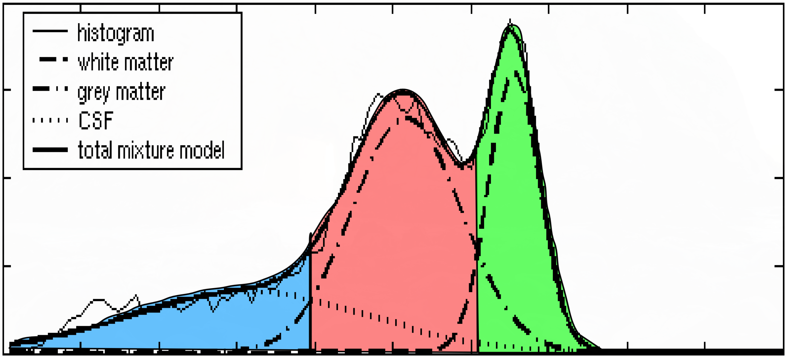

 CSF 

 gray matter 

 white matter 

</section>

# Problem solved? 

Two-component Gaussian mixture model: tumor vs. “other”

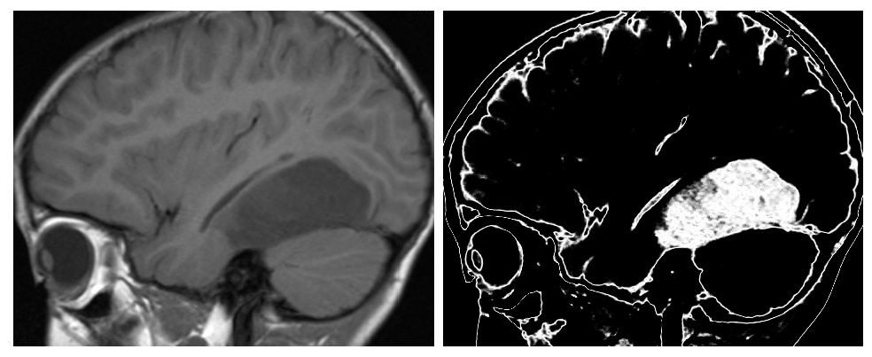

MR scan

Posterior probability for tumor

# Gaussian mixture model

$p(\mathbf{l}|\boldsymbol{\theta}_l)$

&#x21e8;

"labeling model"

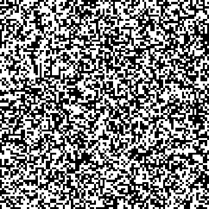

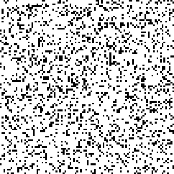

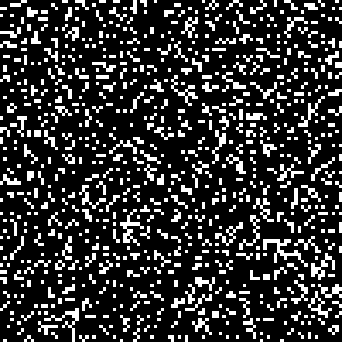

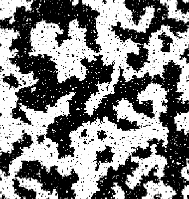

Label image $\mathbf{l}$ 

$p(\mathbf{d}|\mathbf{l}, \boldsymbol{\theta}_d)$

&#x21e8;

"imaging model"

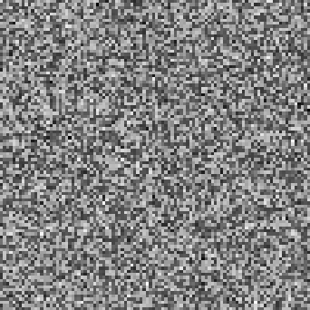

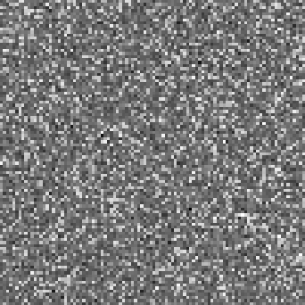

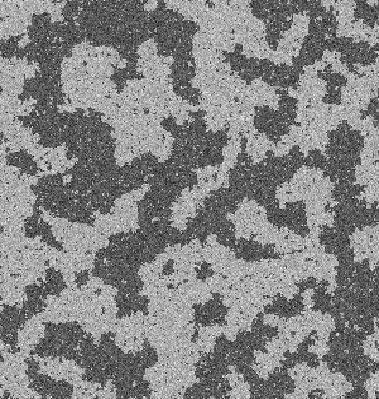

MRI image $\mathbf{d}$ 

$\mu_1=70, \mu_2=90$

$\sigma_1=5, \sigma_2=5$

$\pi_1=0.5, \pi_2=0.5$

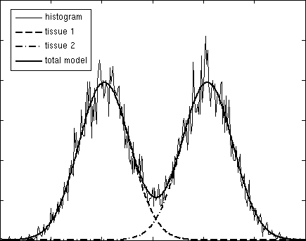

$\mu_1=70, \mu_2=90$

$\sigma_1=5, \sigma_2=5$

$\pi_1=0.2, \pi_2=0.8$

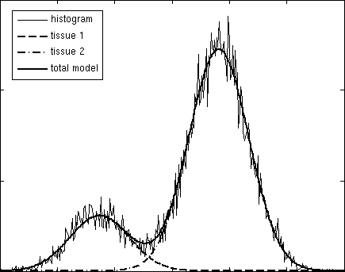

$\mu_1=70, \mu_2=90$

$\sigma_1=5, \sigma_2=5$

$\pi_1=0.8, \pi_2=0.2$

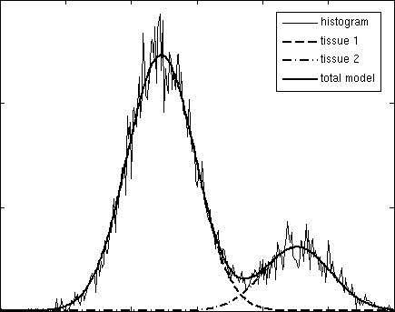

$\mu_1=70, \mu_2=90$

$\sigma_1=5, \sigma_2=5$

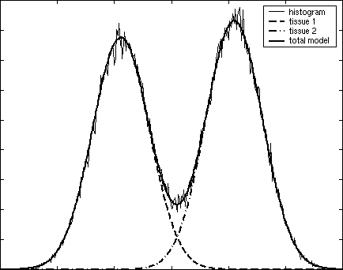

# Markov random field model
- Prior that prefers voxels with the same label to be spatially clustered

$p(\mathbf{l}|\boldsymbol{\theta_l}) = \frac{1}{Z(\boldsymbol{\theta_l})} \exp(-U(\mathbf{l}|\boldsymbol{\theta}_l))$

$U(\mathbf{l}|\boldsymbol{\theta}_l) = \beta\sum_{(i,j)}\delta(l_i\neq l_j)$

sum over all neighboring voxels
 

$p(\mathbf{l}|\boldsymbol{\theta_l}) = \frac{1}{Z(\boldsymbol{\theta_l})} \exp(-U(\mathbf{l}|\boldsymbol{\theta}_l))$

$U(\mathbf{l}|\boldsymbol{\theta}_l) = \beta{\color{blue}\sum_{(i,j)}}\delta(l_i\neq l_j)$

sum over all neighboring voxels
 

$p(\mathbf{l}|\boldsymbol{\theta_l}) = \frac{1}{Z(\boldsymbol{\theta_l})} \exp(-U(\mathbf{l}|\boldsymbol{\theta}_l))$

$U(\mathbf{l}|\boldsymbol{\theta}_l) = \beta\sum_{(i,j)}{\color{blue}\delta(l_i\neq l_j)}$

zero if labels are the same, one otherwise
 

$p(\mathbf{l}|\boldsymbol{\theta_l}) = \frac{1}{Z(\boldsymbol{\theta_l})} \exp(-U(\mathbf{l}|\boldsymbol{\theta}_l))$

$U(\mathbf{l}|\boldsymbol{\theta}_l) = {\color{blue}\beta}\sum_{(i,j)}\delta(l_i\neq l_j)$

Parameter controlling strength of penalization
 

$p(\mathbf{l}|\boldsymbol{\theta_l}) = \frac{1}{Z(\boldsymbol{\theta_l})} \exp(-U(\mathbf{l}|\boldsymbol{\theta}_l))$

$U(\mathbf{l}|\boldsymbol{\theta}_l) = \beta\sum_{(i,j)}\delta(l_i\neq l_j)$

Parameter controlling strength of penalization
 

- $Z(\boldsymbol{\theta_l}) = \sum_{\mathbf{l}}\exp(-U(\mathbf{l}|\boldsymbol{\theta_{l}}))$ is a normalizing constant

Not needed in practice
 

- ${\color{blue}Z(\boldsymbol{\theta_l}) = \sum_{\mathbf{l}}\exp(-U(\mathbf{l}|\boldsymbol{\theta_{l}}))}$ is a normalizing constant

Not needed in practice
 

# Markov random field model
- Slightly more general 

$p(\mathbf{l}|\boldsymbol{\theta_l}) = \frac{1}{Z(\boldsymbol{\theta_l})} \exp(-U(\mathbf{l}|\boldsymbol{\theta}_l))$

$U(\mathbf{l}|\boldsymbol{\theta}_l) = \beta\sum_{(i,j)}\delta(l_i\neq l_j) {\color{blue}-\sum_i\log(\pi_{l_i})}$

 

 

- $\boldsymbol{\theta_l} = (\beta, \pi_{1},\dots,\pi_{K})^T$ are the model parameters
- Reduces to Gaussian mixture model prior $p(\mathbf{l}|\boldsymbol{\theta_{l}}) = \prod_{n}\pi_{{l_{n}}}$ for $\beta=0$!

# Toy example

$N=2$ voxels 

$K=3$ classes 

$\mathbf{l}=\begin{pmatrix}l_1 \\ l_2 \end{pmatrix}$

$\beta = 0$

$p(\mathbf{l}) = p(l_2 | {\color{red}\cancel{{\color{black}l_1}}})p(l_1)$

$\beta = 3.0$

$p(\mathbf{l}) = p(l_1, l_2)$

# Samples

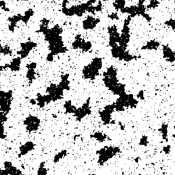
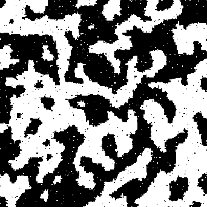
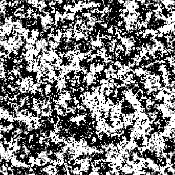

Different values for model parameters $\boldsymbol{\theta_{l}} = (\beta,\pi_{1},\dots,\pi_{K})^{T}$

# Why exactly this model
- Long-range statistical dependencies between voxels
- Local computations (efficient!):

$\begin{align}
p(l_i|l_{\setminus i}) &= \frac{p(\mathbf{l})}{p(\mathbf{l}_{\setminus i})}\\
&= \frac{p(\mathbf{l})}{\sum_{l_i}p(\mathbf{l})}\\
&= \frac{\exp(-U(\mathbf{l}|\boldsymbol{\theta_l}))}{\sum_{l_i} \exp(-U(\mathbf{l}|\boldsymbol{\theta_l}))}\\
&= \frac{\pi_{l_i}\cdot\exp(-\beta\sum_{j\in\mathfrak{N}_i}\delta(l_i\neq l_j))}{\sum_{k}\pi_{k}\cdot\exp(-\beta\sum_{j\in\mathfrak{N}_i}\delta(l_i\neq k))}
\end{align}$

All labels except the one of voxel $i$

$\begin{align}
p(l_i|{\color{blue}l_{\setminus i}}) &= \frac{p(\mathbf{l})}{p(\mathbf{l}_{\setminus i})}\\
&= \frac{p(\mathbf{l})}{\sum_{l_i}p(\mathbf{l})}\\
&= \frac{\exp(-U(\mathbf{l}|\boldsymbol{\theta_l}))}{\sum_{l_i} \exp(-U(\mathbf{l}|\boldsymbol{\theta_l}))}\\
&= \frac{\pi_{l_i}\cdot\exp(-\beta\sum_{j\in\mathfrak{N}_i}\delta(l_i\neq l_j))}{\sum_{k}\pi_{k}\cdot\exp(-\beta\sum_{j\in\mathfrak{N}_i}\delta(l_i\neq k))}
\end{align}$

All labels except the one of voxel $i$

$\begin{align}
p(l_i|l_{\setminus i}) &= \frac{p(\mathbf{l})}{p(\mathbf{l}_{\setminus i})}\\
&= \frac{p(\mathbf{l})}{\sum_{l_i}p(\mathbf{l})}\\
&= \frac{\exp(-U(\mathbf{l}|\boldsymbol{\theta_l}))}{\sum_{l_i} \exp(-U(\mathbf{l}|\boldsymbol{\theta_l}))}\\
&= \frac{\pi_{l_i}\cdot\exp(-\beta\sum_{j\in{\color{blue}\mathfrak{N}_i}}\delta(l_i\neq l_j))}{\sum_{k}\pi_{k}\cdot\exp(-\beta\sum_{j\in{\color{blue}\mathfrak{N}_i}}\delta(l_i\neq k))}
\end{align}$

Neighbors of voxel $i$

# Mean field approximation
- In the Gaussian mixture model, the posterior was of the form

$p(\mathbf{l}|\mathbf{d}, \boldsymbol{\hat{\theta}}) = \prod_n p(l_n|d_n, \boldsymbol{\hat{\theta}})$

- With the Markov random field model, the posterior no longer "factorizes" that way
- For a 2-label model in a standard $256\times 256 \times 128$ MR scan, there are over $10^{1000000}$  unique label images with each its own posterior probability!
- Solution: approximate: $p(\mathbf{l}|\mathbf{d}, \boldsymbol{\hat{\theta}})$

# Mean field approximation
- Approximate $p(\mathbf{l}|\mathbf{d}, \boldsymbol{\hat{\theta}})$ with something of the form

$q(\mathbf{l}) = \prod_n q_n(l_n)$

- Find the voxel-wise distributions $q_n(k)$ that minimize the difference between $q(\mathbf{l})$ and $p(\mathbf{l}|\mathbf{d},\boldsymbol{\hat{\theta}})$

- Quantify the difference between the two distributions using the "Kullback-Leibler divergence"

$KL(q(\mathbf{l})\parallel p(\mathbf{l}|\mathbf{d},\boldsymbol{\hat{\theta}})) = -\sum_{\mathbf{l}}q(\mathbf{l})\log\frac{p(\mathbf{l}|\mathbf{d},\boldsymbol{\hat{\theta}})}{q(\mathbf{l})}$

# Toy example

$N=2$ voxels 

$K=3$ classes 

$\mathbf{l}=\begin{pmatrix}l_1 \\ l_2 \end{pmatrix}$

$p(\mathbf{l}|\mathbf{d}) = p(l_1, l_2|d_1, d_2) \simeq q(l_1)q(l_2)$ 

 $\simeq$ 

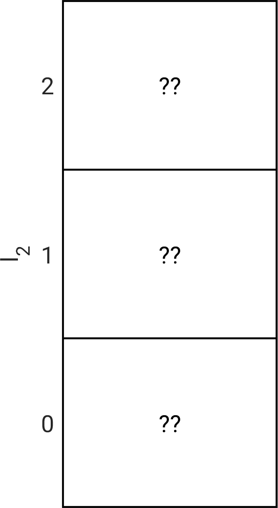

 $\cdot$ 

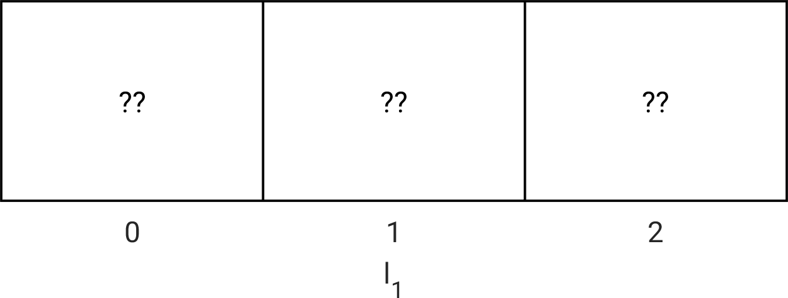

# Mean field approximation
- Solution for one voxel $i$:

$q_{i}(l_{i}) = \frac{\mathcal{N}(d_{i}|\hat{\mu}_{l_{i}},\hat{\sigma}_{l_{i}}^{2})\gamma_{i}(l_{i})}{\sum_{k}\mathcal{N}(d_{i}|\hat{\mu}_{k},\hat{\sigma}_{k}^{2})\gamma_{i}(k)}$

where $\gamma_{i}(k) = \frac{\hat{\pi}_{k} \cdot \exp(-\beta \sum_{j\in\mathfrak{N}_{i}}(1-q_{j}(k)))}{\sum_{k\prime} \hat{\pi}_{k\prime} \cdot \exp(-\beta \sum_{j\in\mathfrak{N}_{i}}(1-q_{j}(k\prime)))}$

 Influenced by the result in neighboring voxels: spatial context! 

where $\gamma_{i}(k) = \frac{\hat{\pi}_{k} \cdot {\color{blue}\exp(-\beta \sum_{j\in\mathfrak{N}_{i}}(1-q_{j}(k)))}}{\sum_{k\prime} \hat{\pi}_{k\prime} \cdot {\color{blue}\exp(-\beta \sum_{j\in\mathfrak{N}_{i}}(1-q_{j}(k\prime)))}}$

 Influenced by the result in neighboring voxels: <b>spatial context!</b> 

 <b>Need to iterate across all voxels</b>

# Example 

Two-component Gaussian mixture model: tumor vs. “other”

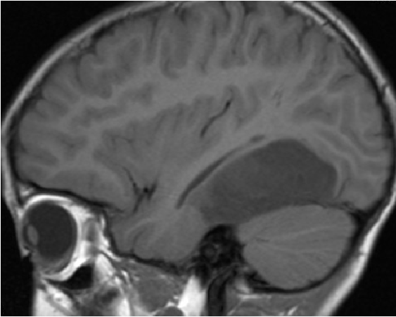

MR scan

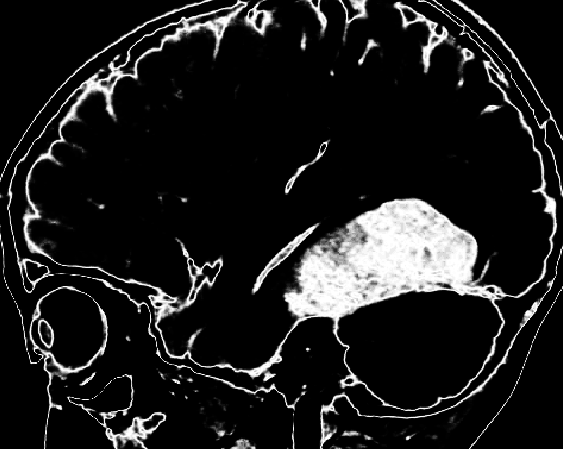

$q_{n}(k)$ for tumor class $\beta=0$

MR scan

$q_{n}(k)$ for tumor class $\beta=0.25$

MR scan

$q_{n}(k)$ for tumor class $\beta=0.55$

