# Course structure
<section data-state="slide1">

 "Fitting functions"

\n

 "Registration"

 "Segmentation"

</section>

# Remeber regression?
<section data-state="slide2">
-  $f(x) = \sum_{m=1}^M \beta_{m}\phi_{m}(\mathbf{x})$ 
- Training set  $\{\mathbf{x}_{i}, y_{i}\}_{i=1}^{N}$ 
  - Input vector:  $\mathbf{x}_{i} = (x_{i1}, x_{i2}, \dots, x_{ip})^{T}$ 
  - Corresponding ouput: $y_{i}$
- Estimate parameters $\boldsymbol{\theta} = (\beta_{1}, \dots, \beta_{M})^{T}$    by minimizing the cost $\sum_{i=1}^N (y_{i} - f(\mathbf{x}_{i}))^2$
</section>

# Remember regression?
<section data-state="slide3">

 Example: p=1 and M=5 cosines 

 $\phi_m(\mathbf{x})$ 
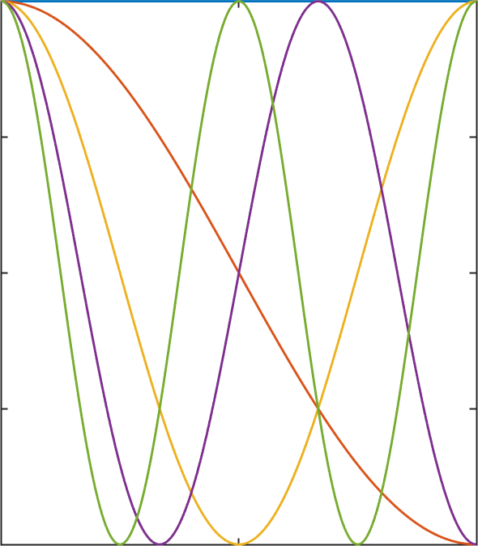
$\mathbf{x}$ 

 $f(\mathbf{x}) = \sum_{m=1}^{M} \beta_{m}\phi_{m}(\mathbf{x})$ 
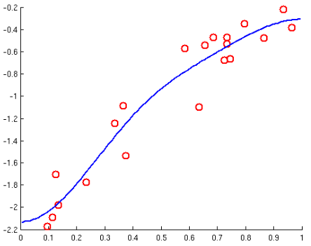
 $\mathbf{x}$ 

</section>

# Remeber Gaussian mixture model?
<section data-state="slide4">

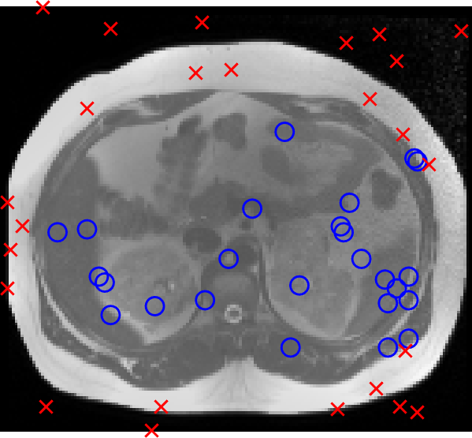

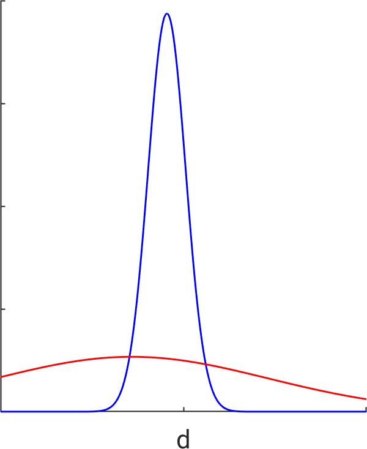

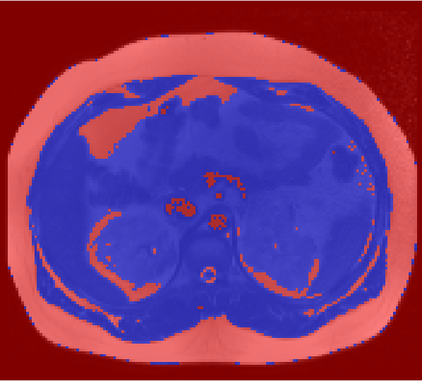

 This lecture: can we get a "classifier": 

 $p(l|d,\boldsymbol{\theta})$ 

directly <u><b> without a model?</b></u>  

 New notation/terminology: 

"Training samples" 

  "y=1"       if l=1 

  "y=0"       if l=2  

 Posterior using Bayes' rule: $p(l=k|d,\boldsymbol{\theta}) = \frac{\mathcal{N}(d||\mu_{k}, \sigma_{k}^{2})\pi_{k}}{\sum_{k^{\prime}}\mathcal{N}(d|\mu_{k^{\prime}}, \sigma_{k^{\prime}}^{2})\pi_{k^{\prime}}}$ 

</section>

# Logistic regression
<section data-state="slide5">

Logistic function as a "squashing" function

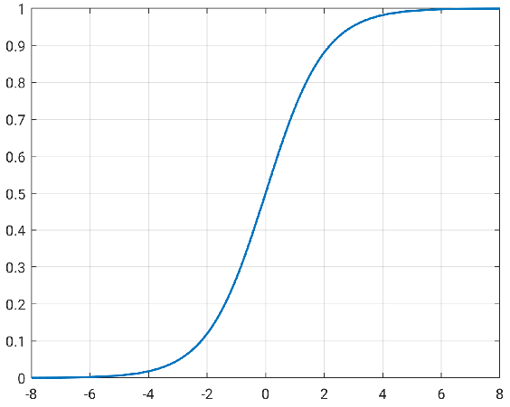

 $\sigma(a) = \frac{1}{1+\exp(-a)}$ 

</section>

# Logistic regression
<section data-state="slide6">

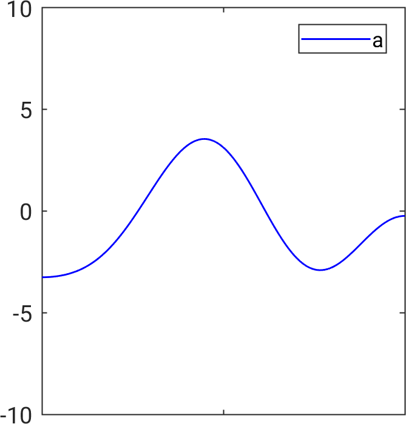

 $a=\sum_{m=1}^{M}\beta_m\phi_m(\mathbf{x})$ 

 $\sigma(a) = \frac{1}{1+\exp(-a)}$ 

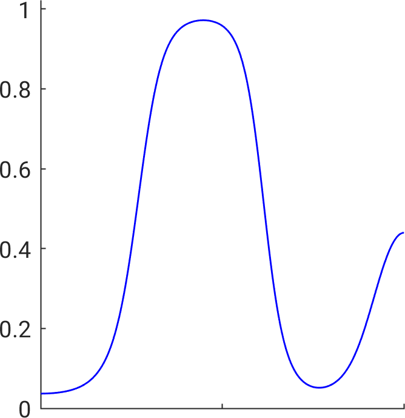

-  $p(y=1|\mathbf{x}, \boldsymbol{\theta})$  where  $f(\mathbf{x}) = \sigma\left(\sum_{m=1}^{M}\beta_{m}\phi_{m}(\mathbf{x})\right)$ 
-  Of course:  $p(y=0|\mathbf{x}, \boldsymbol{\theta}) = 1 - p(y=1|\mathbf{x}, \boldsymbol{\theta}) = 1 - f(\mathbf{x})$ 

</section>

# Voxel-based classifier
<section data-state="slide7">

-  Training data $\{\mathbf{x}_{i}, y_{i}\}_{i=1}^{N}$ with $\mathbf{x}_i = d_i$ (i.e., $p=1$) and $y_i\in{0,1}$  
-  Estimate paremeters $\boldsymbol{\theta} = (\beta_{1},\dots,\beta_{M})^T$ by maximizing the likelihood function $\prod_{i}^N p(y_i|\mathbf{x}_i, \boldsymbol{\theta})$  

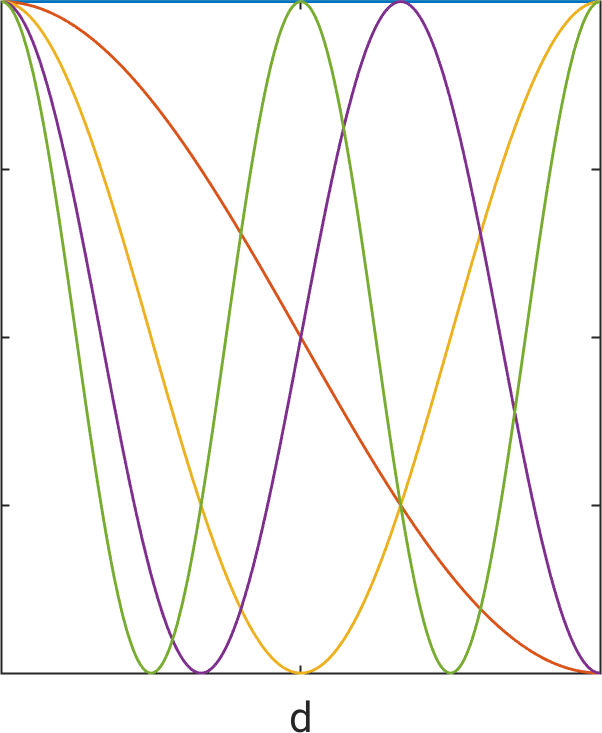

  
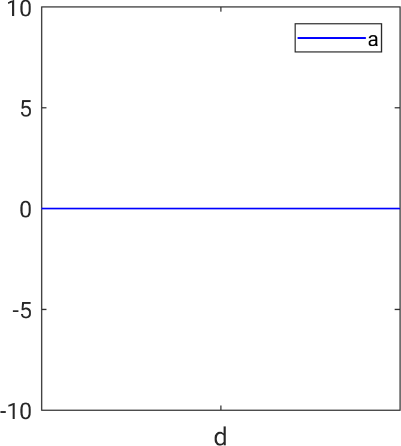

  
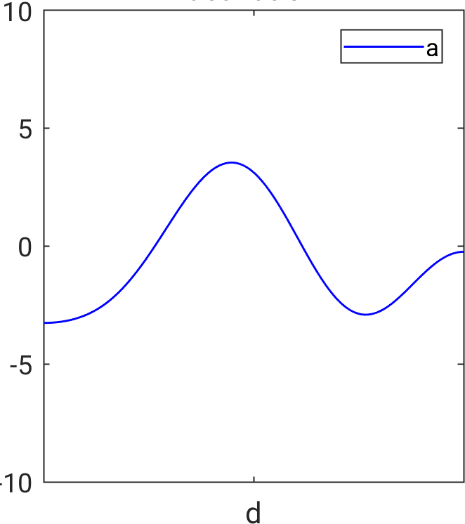

  
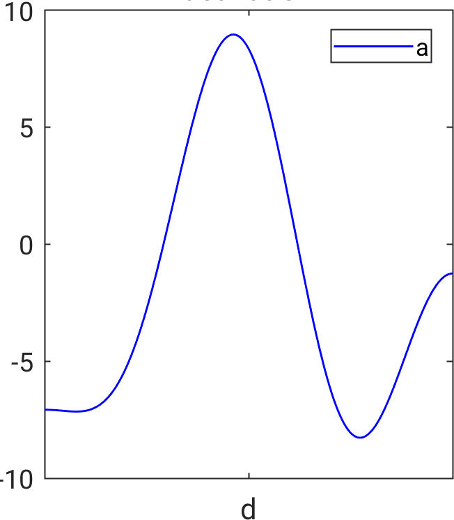

  
 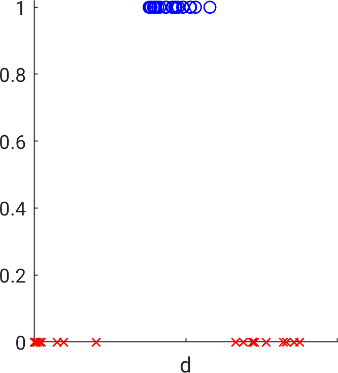 

  
 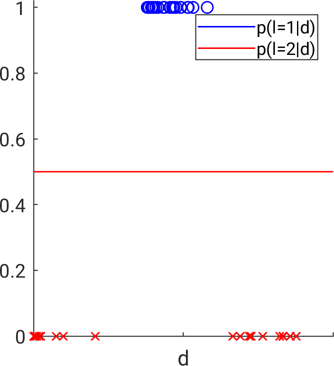 

  
 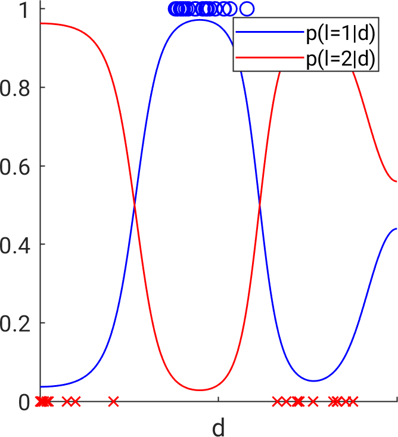 

  
 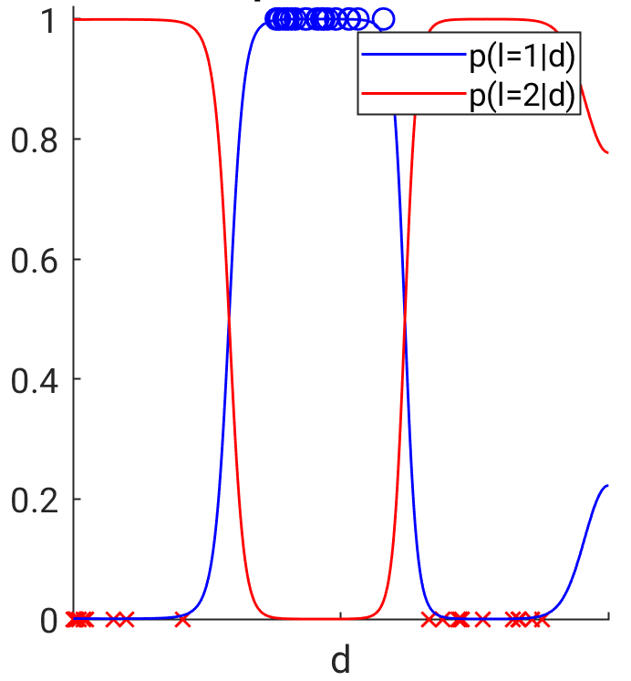 

</section>

# Voxel-based classifier
<section data-state="slide8">

-  Once trained keep the classifier:  $p(l=1 | d, \boldsymbol{\hat{\theta}})$  
-  Simply apply it to new data  

  <figure>
  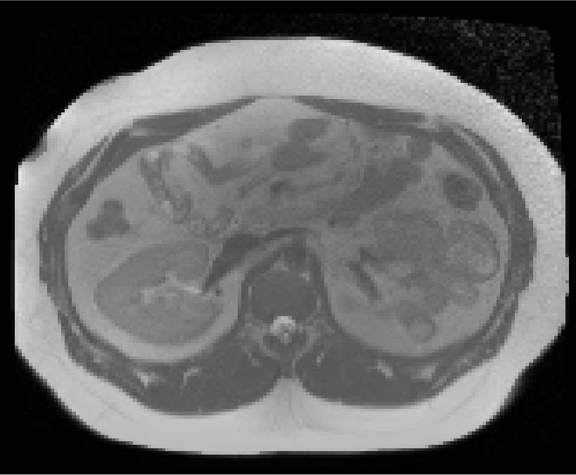
  <figcaption>  $\hspace{2mm}$ </figcaption>
  </figure>
  <figure>
  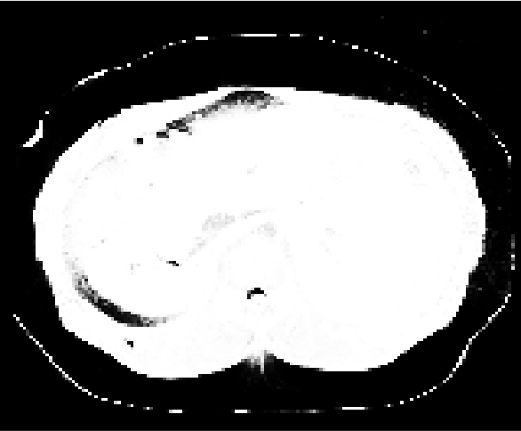
  <figcaption> $p(l | d, \boldsymbol{\hat{\theta}})$ </figcaption>
  </figure>
  <figure>
  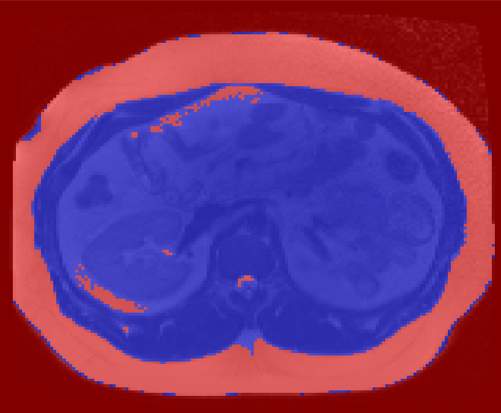
  <figcaption>$p(l | d, \boldsymbol{\hat{\theta}}) > 0.5$</figcaption>
  </figure>

</section>

# Optimization algorithm for training
<section data-state="slide9">
-  Maximizing the likelihood function $\prod_{i=1}^{N}p(y_{i}|\mathbf{x}_{i},\boldsymbol{\theta})$ is equivalent to minimizing   
 $$\begin{align} E_N(\boldsymbol{\theta}) &= -\log \prod_{i=1}^{N} p(y_i | \mathbf{x}_i, \boldsymbol{\theta})\\ &=- \sum_{i=1}^{N}\{y_i\log f(\mathbf{x}_i) + (1-y_i)\log[1-f(\mathbf{x}_i)]\}\end{align}$$ 

 step size (user-specified) 

-   Gradient descent:   $\boldsymbol{\theta}^{(\tau+1)} = \boldsymbol{\theta}^{(\tau)} - \nu\nabla E_N(\boldsymbol{\theta}^{(\tau)})$  with gradient  $\nabla E_N(\boldsymbol{\theta}) = \frac{\partial E_{N}}{\partial \boldsymbol{\theta}}$  

-   Stochastic gradient descent:   use only  $N^{\prime} \ll N$ randomly sampled training points, and approximate:   

  $\nabla E_{N}(\boldsymbol{\theta}) \simeq \frac{N}{N^{\prime}}\nabla E_{N^{\prime}}(\boldsymbol{\theta})$  

</section>

# More fun: patch-based classifier

- Classify 3x3 image "patches": intensity of the pixel to be classified + intensities of 8 neigboring pixels
- $\mathbf{x}$ is now a 9-dimensional vector ($p=9$), but otherwise everything is the same:   

  $p(y=1|\mathbf{x}, \boldsymbol{\hat{\theta}}) = \sigma (\sum_{m=1}^{M} \hat{\beta}_{m}\phi_{m}(\mathbf{x}))$ 
 
- But how to choose basis functions $\phi_{m}(\mathbf{x})$ in a 9-dimensional space?

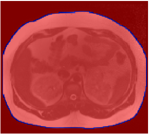

# Basis functions in high dimensions
<section data-state="slide10">

- Idea: remember the tensor B-spline trick?

 Example: take outer products of four 1D basis functions to "make" sixteen 2D basis functions 

- Does this work in 9D?

<figure>
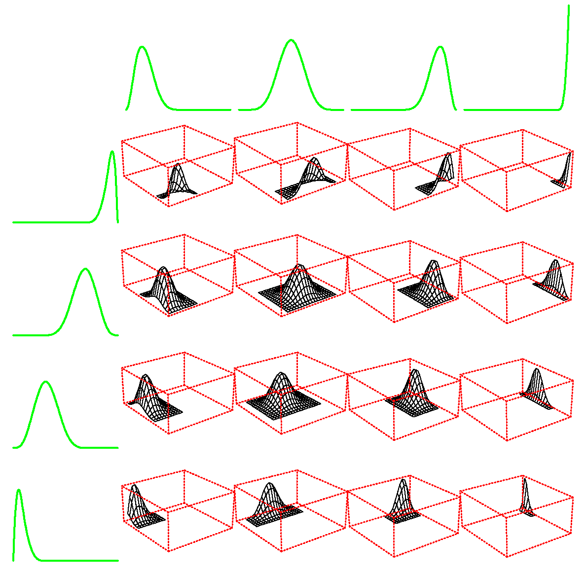
  <figcaption style="height:25px;width:200px;border:2px solid gray;float:center;text-align:center;margin-left:30%;margin-bottom:20px;"> 
  
 2-D: "tensor B-spline"

  </figcaption>
</figure>

 No! $4^9 = 2621444$ basis functions! 

</section>

# Adaptive basis functions
<section data-state="slide11">
- Introduce extra parameters that alter the <em> form </em> of a limited set of basis functions
- 
 Prototypical example:    $\phi_{m}(\mathbf{x}) = \begin{cases} 1 & \text{if} \  m=1,\\ \sigma(\sum_{j=1}^{p} w_{m,j}x_{j} + w_{m,0}) & \text{otherwise} \end{cases}$
 
 

 Extra parameters 

- All parameters ($\{w_{m,j}\}$ and $\{\beta_{m}\}$) optimized together during training (stochastic gradient descent)
</section>

# Adaptive basis functions (p=1)
<section data-state="slide12">

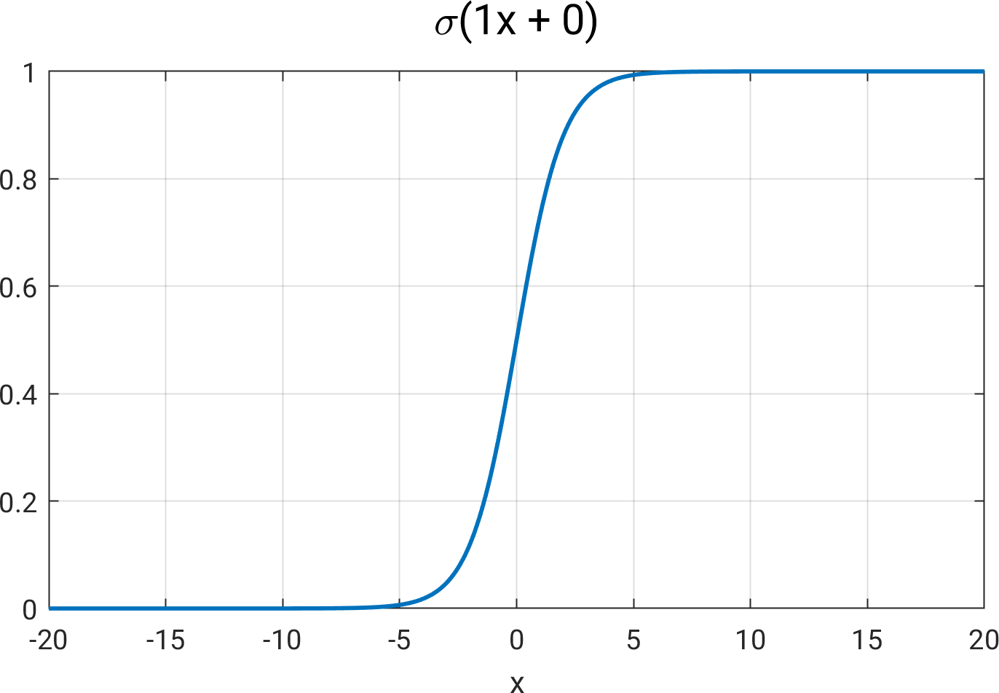

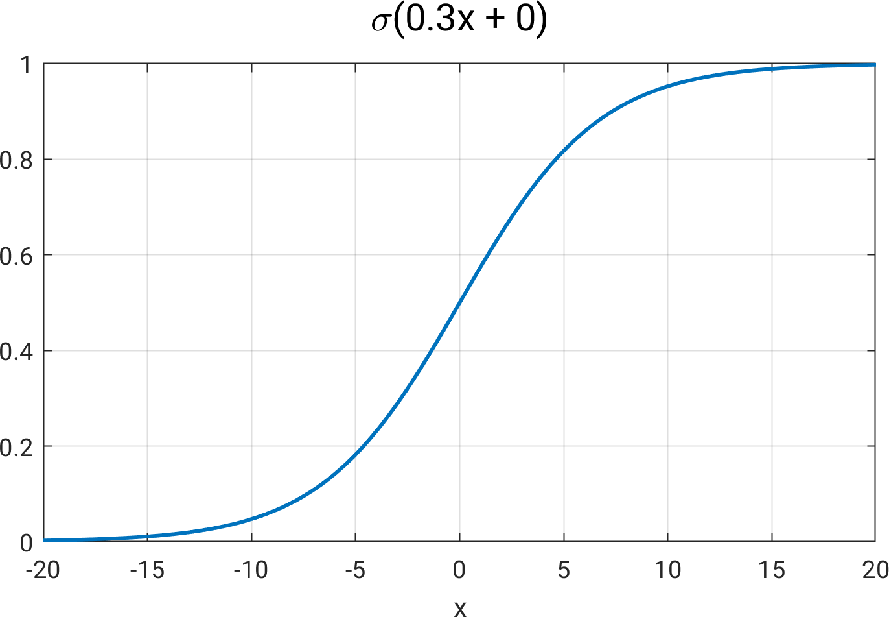

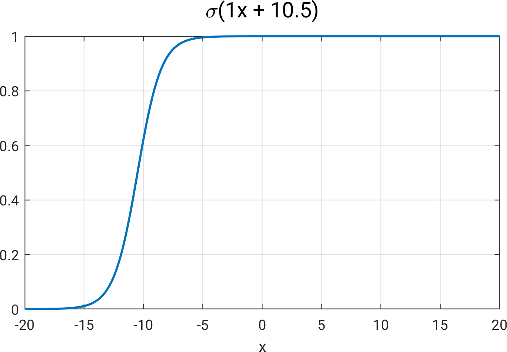

</section>

# Adaptive basis functions (p=2)

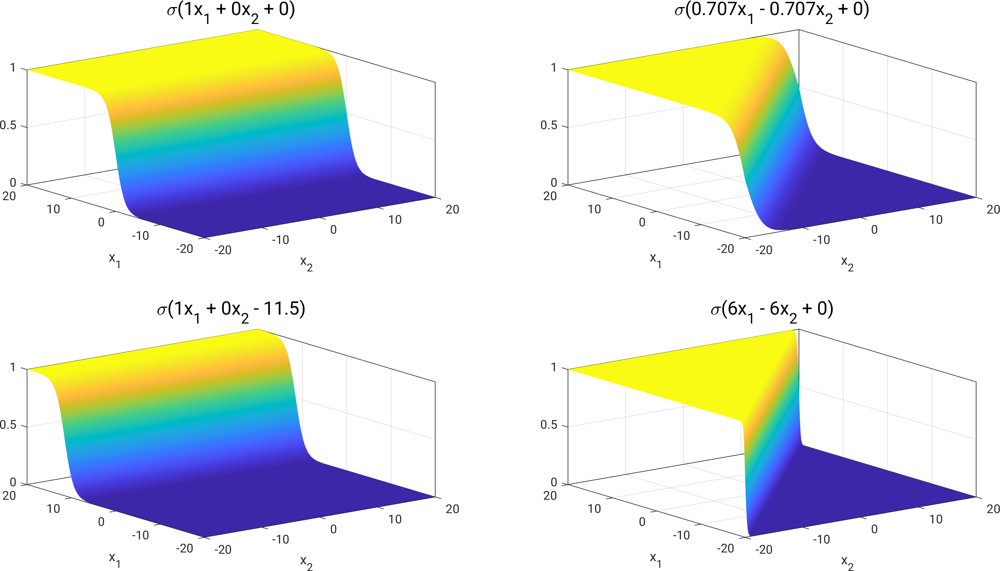

# Feed-forward neural network
<section data-state="slide13">

 So the model is $p(y=1|\mathbf{x}, \boldsymbol{\theta}) = \sigma(\sum_{m=1}^{M} \beta_{m}\phi_{m}(\mathbf{x}))$

 

 parameters 

 with basis functions 
 

 

 $\phi_{m}(\mathbf{x}) = \begin{cases} 1 & \text{if} \  m=1,\\ \sigma(\sum_{j=1}^{p} w_{m,j}x_{j} + w_{m,0}) & \text{otherwise} \end{cases}$ 
 

</section>

# Feed-forward neural network
<section data-state="slide14">

 Graphical representation of our 3x3 patch-based classifier ($p=9$ and $M=4$):

"hidden units"

 
 flow of information 

- Can insert more than one "hidden" layer ("deep learning")

</section>

# 
<section data-state="slide15">

 Applying the trained classifier on new data:  
 

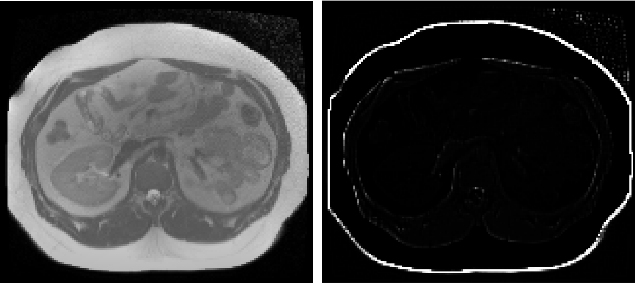

$p(y=1|\mathbf{x}, \boldsymbol{\hat{\theta}})$

 Filtering operations can be implemented using convolutions 
 

 $\Rightarrow$ "convolutional neural network" 

$\{w_{2,1}, \dots, w_{2,9}\}$

$\{w_{3,1}, \dots, w_{3,9}\}$

$\{w_{4,1}, \dots, w_{4,9}\}$

 
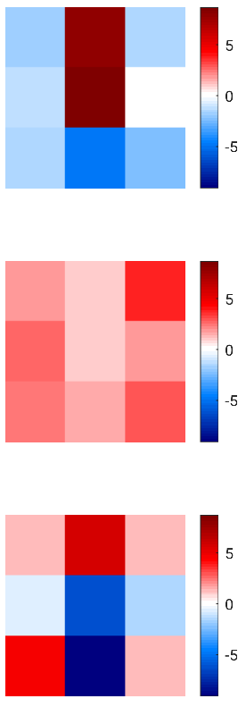

 
 filter 

 
 filter 

 
 filter 

$\phi_2(\mathbf{x})$

$\phi_3(\mathbf{x})$

$\phi_4(\mathbf{x})$

 
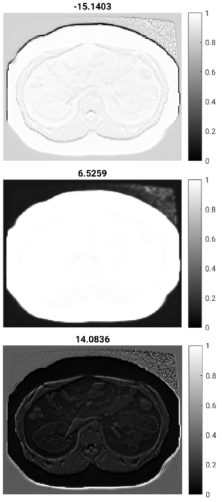

</section>

# Neural networks = the ultimate solution?

 <u><b> No model, only training data: </b></u>

 

- No domain expertise needed
- Very easy to train and deploy
- Super fast (GPUs)
 
 
- Training data often very hard to get in medical imaging!
- Scanning hardware/software/protocol changes routinely!

