# Course structure
<section data-state="slide1">

 "Fitting functions"

\n

 "Registration"

 "Segmentation"

</section>

# Elements in image registration
<section data-state="slide2">
- Geometrical transformation: $\quad \mathbf{y}(\mathbf{x};\mathbf{w})$ $: \mathbb{R}^{2} \rightarrow \mathbb{R}^{2}$ or $\mathbb{R}^{3} \rightarrow \mathbb{R}^{3}$
- Similarity measure: $\quad\mathcal{D}(\mathbf{w})$
- Regularization: $\quad\mathcal{S}(\mathbf{w})$
- Optimization algorith: $\quad\mathcal{J}(\mathbf{w}) = \mathcal{D}(\mathbf{w}) + \alpha\mathcal{S}(\mathbf{w})$
</section>

# Geometrical transformation
<section data-state="slide3">

 
 Coordinates in image $\mathcal{R}$ 

 
 parameters of the transformation 

 
 resulting coordinates in image $\mathcal{T}$

$\quad \mathbf{y}(\mathbf{x};\mathbf{w}): \mathbb{R}^{2} \rightarrow \mathbb{R}^{2}$ or $\mathbb{R}^{3} \rightarrow \mathbb{R}^{3}$ 

$\quad \mathbf{y}(\textcolor{blue}{\mathbf{x}};\mathbf{w}): \mathbb{R}^{2} \rightarrow \mathbb{R}^{2}$ or $\mathbb{R}^{3} \rightarrow \mathbb{R}^{3}$ 

$\quad \mathbf{y}(\mathbf{x};\textcolor{blue}{\mathbf{w}}): \mathbb{R}^{2} \rightarrow \mathbb{R}^{2}$ or $\mathbb{R}^{3} \rightarrow \mathbb{R}^{3}$ 

$\quad \textcolor{blue}{\mathbf{y}(\mathbf{x};\mathbf{w})}: \mathbb{R}^{2} \rightarrow \mathbb{R}^{2}$ or $\mathbb{R}^{3} \rightarrow \mathbb{R}^{3}$ 

 
$\mathbf{x}$

 
$\mathbf{w}$

 
$\mathbf{y}(\mathbf{x};\mathbf{w})$

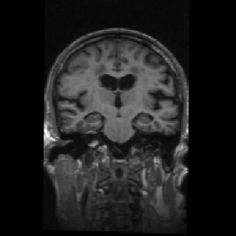

</section>

# Linear transformations
<section data-state="slide4">

 translation 

  <input type="range" min="-50" max="50" value="-20" class="slider" orient="vertical" id="translation_slider" style="outline:none; opacity:0.7 width:50px; height:100px" >

<svg width="120" height="120">
  <use href="#trans_grid" />
</svg>
<svg width="120" height="120" style="transform:translate(0px,-20px)" id="translate_grid">
  <use href="#trans_grid" />
</svg>

  $\mathbf{y}(\mathbf{x};\mathbf{t}) = \mathbf{x}+\mathbf{t}$ 

 rigid: translation + rotation 

  <input type="range" min="-90" max="90" value="20" class="slider" orient="vertical" id="rotation_slider" style="outline:none; opacity:0.7 width:50px; height:100px" >

<svg width="120" height="120">
  <use href="#trans_grid" />
</svg>
<svg width="120" height="120" style="transform:translate(10px,-20px) rotate(20deg);" id="rotate_grid">
  <use href="#trans_grid" />
</svg>

 
 $\mathbf{y}(\mathbf{x};\mathbf{R},\mathbf{t}) = \mathbf{R}\mathbf{x}+\mathbf{t}$    
 $\mathbf{R}^{T}\mathbf{R} = \mathbf{I}, \quad \det(\mathbf{R}) = 1$    

 similarity transformation 

  <input type="range" min="0.5" max="1.5" value="1.1" step="0.1" class="slider" orient="vertical" id="scale_slider" style="outline:none; opacity:0.7 width:50px; height:100px" >

<svg width="120" height="120">
  <use href="#trans_grid" />
</svg>
<svg width="120" height="120" style="transform: scale(1.1) rotate(20deg) translate(20%,-20%);" id="scale_grid">
  <use href="#trans_grid" />
</svg>

 $\mathbf{y}(\mathbf{x};s,\mathbf{R},\mathbf{t}) = s\mathbf{R}\mathbf{x}+\mathbf{t}, \quad s>0$    

 affine transformation 

  <input type="range" min="-40" max="40" value="-30" class="slider" orient="vertical" id="skew_slider" style="outline:none; opacity:0.7 width:50px; height:100px" >

<svg width="120" height="120">
  <use href="#trans_grid" />
</svg>
<svg width="120" height="120" style="transform:scale(0.8, 1.2) rotate(10deg) translate(20%,-20%) skewX(-30deg);" id="skew_grid">
  <use href="#trans_grid" />
</svg>

 $\mathbf{y}(\mathbf{x};\mathbf{A},\mathbf{t}) = \mathbf{A}\mathbf{x}+\mathbf{t}$    

</section>

# Non-linear transformations
<section data-state="slide5">

<svg width="250" height="250" style="transform:translate(-40px,0px)">
  <use href="#trans_grid" />
</svg>
<svg width="250" height="250" style="transform:translate(40px,0px)">
  <use href="#deformed_grid" />
</svg>

- Tissue motion (cardiac cycle/respiratory motion)
- Deformation compensation (intra-operative, soft tissue)
- Longitudinal tissue changes (e.g., tumor growth)
- Inter-subject registration
</section>

# Canonical form
<section data-state="slide6">

 $\mathbf{y}(\mathbf{x};\mathbf{w}) = \mathbf{x} + \mathbf{u}(\mathbf{x};\mathbf{w})$ 

 
Identity part

 
Deformation part

</section>

# Canonical form
 $\mathbf{y}(\mathbf{x};\mathbf{w}) = \mathbf{x} + \mathbf{u}(\mathbf{x};\mathbf{w})$ 

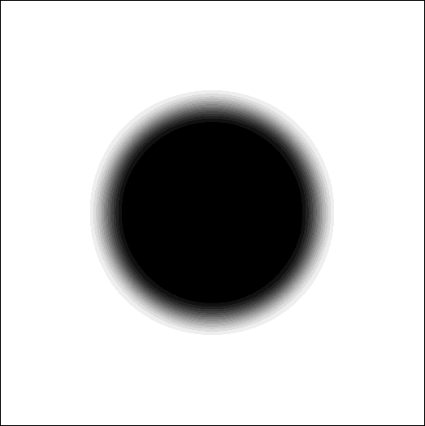

$\mathcal{R}$

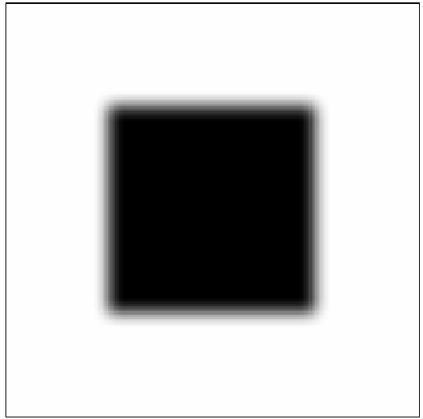

$\mathcal{T}$

$\mathbf{u}(\mathbf{x};\mathbf{w})$

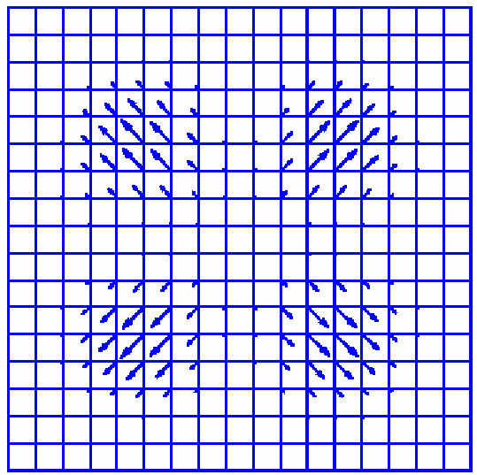

$\mathbf{y}(\mathbf{x};\mathbf{w})$

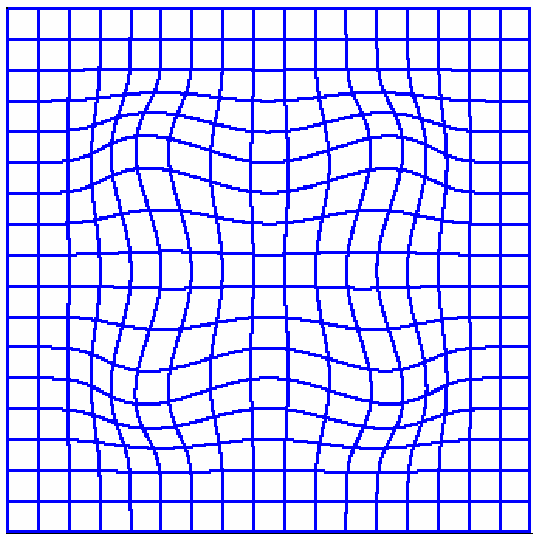

$\mathcal{T}(\mathbf{y}(\mathbf{x};\mathbf{w}))$

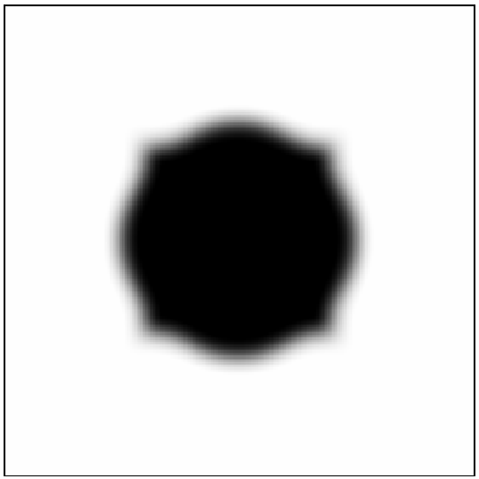

# Affine transformation
<section data-state="slide8">

$\begin{align}\mathbf{y}(\mathbf{x}_{i};\mathbf{A},\mathbf{t}) &= \mathbf{A}\mathbf{x}_{i} + \mathbf{t}\\
&= \mathbf{x}_{i} + \underbrace{(\mathbf{A} - \mathbf{I}_{3})\mathbf{x}_{i} + \mathbf{t}}_{\mathbf{u}(\mathbf{x}_{i};\mathbf{A},\mathbf{t})}\end{align}$
 
 
with $\mathbf{A} = \begin{pmatrix} a_{11} & a_{12} & a_{13}\\
                                   a_{21} & a_{22} & a_{23}\\
                                   a_{31} & a_{32} & a_{33}\end{pmatrix}$
and $\mathbf{t} = \begin{pmatrix}t_{1} \\ t_{2} \\ t_{3} \end{pmatrix}$

 <b> All-important trick:</b>  look at each coordinate $k$ separately!

$\begin{align}\\
y^k(\mathbf{x}_i;\mathbf{A},\mathbf{t}) &= x^k_i + \mathbf{q}(\mathbf{x}_i)^T\mathbf{w}^k\\\\
\mathbf{q}(\mathbf{x}_i) &= (1,x^1_i,x^2_i,x^3_i)^T\\\\
\mathbf{w}^k &= (t_k, a_{k1}, -1, a_{k2}, a_{k3})^T
\end{align}$

 (for $k=1$)

</section>

# Affine transformation
<section data-state="slide9">

In matrix form: (all $N$ input points simultaneously)

 

Define

$\mathbf{x}^{k} = \begin{pmatrix}x_{1}^{k}\\x_{2}^{k}\\\vdots\\x_{N}^{k}\end{pmatrix} \quad \mathbf{y}^{k} = \begin{pmatrix}y_{1}^{k}\\y_{2}^{k}\\\vdots\\y_{N}^{k}\end{pmatrix} \quad
\mathbf{Q\prime} = \begin{pmatrix}1 & x_{1}^{1} & x_{1}^{2} & x_{1}^{3}\\ 1 & x_{2}^{1} & x_{2}^{2} & x_{2}^{3}\\\vdots & \vdots & \vdots &\vdots \\ 1 & x_{N}^{1} & x_{N}^{2} & x_{N}^{3}\end{pmatrix}$
 
 

&#x21e8;

$\mathbf{y}^{k} = \mathbf{x}^{k} + \mathbf{Q\prime}\mathbf{w}_{k}$

</section>

# Affine transformation
<section data-state="slide10">

<svg width="200" height="200" position="fixed">
  <use href="#trans_grid" />
</svg>
<svg width="200" height="200" transform="matrix(1 0 0 1 0 0)" id="moving_grid">
  <use href="#trans_grid"/>
</svg>

$\mathbf{y}^{1}=\mathbf{x}^{1} + \mathbf{Q\prime}\begin{pmatrix}0\\0\\0\end{pmatrix},\quad
\mathbf{y}^{2}=\mathbf{x}^{2} + \mathbf{Q\prime}\begin{pmatrix}0\\0\\0\end{pmatrix},\quad
\mathbf{A} = \begin{pmatrix}1 & 0\\0 & 1\end{pmatrix}, \quad \mathbf{t} = \begin{pmatrix}0\\0 \end{pmatrix}$

$\mathbf{y}^{1}=\mathbf{x}^{1} + \mathbf{Q\prime}\begin{pmatrix}240\\0\\0\end{pmatrix},\quad
\mathbf{y}^{2}=\mathbf{x}^{2} + \mathbf{Q\prime}\begin{pmatrix}0\\0\\0\end{pmatrix},\quad
\mathbf{A} = \begin{pmatrix}1 & 0\\0 & 1\end{pmatrix}, \quad \mathbf{t} = \begin{pmatrix}240\\0 \end{pmatrix}$

$\mathbf{y}^{1}=\mathbf{x}^{1} + \mathbf{Q\prime}\begin{pmatrix}240\\0.3\\0\end{pmatrix},\quad
\mathbf{y}^{2}=\mathbf{x}^{2} + \mathbf{Q\prime}\begin{pmatrix}0\\0\\0\end{pmatrix},\quad
\mathbf{A} = \begin{pmatrix}1.3 & 0\\0 & 1\end{pmatrix}, \quad \mathbf{t} = \begin{pmatrix}240\\0 \end{pmatrix}$

$\mathbf{y}^{1}=\mathbf{x}^{1} + \mathbf{Q\prime}\begin{pmatrix}240\\0\\0.2\end{pmatrix},\quad
\mathbf{y}^{2}=\mathbf{x}^{2} + \mathbf{Q\prime}\begin{pmatrix}0\\0\\0\end{pmatrix},\quad
\mathbf{A} = \begin{pmatrix}1 & 0.2\\0 & 1\end{pmatrix}, \quad \mathbf{t} = \begin{pmatrix}240\\0 \end{pmatrix}$

$\mathbf{y}^{1}=\mathbf{x}^{1} + \mathbf{Q\prime}\begin{pmatrix}240\\0.3\\0.2\end{pmatrix},\quad
\mathbf{y}^{2}=\mathbf{x}^{2} + \mathbf{Q\prime}\begin{pmatrix}0\\0\\0\end{pmatrix},\quad
\mathbf{A} = \begin{pmatrix}1.3 & 0.2\\0 & 1\end{pmatrix}, \quad \mathbf{t} = \begin{pmatrix}240\\0 \end{pmatrix}$

$\mathbf{y}^{1}=\mathbf{x}^{1} + \mathbf{Q\prime}\begin{pmatrix}0\\0\\0\end{pmatrix},\quad
\mathbf{y}^{2}=\mathbf{x}^{2} + \mathbf{Q\prime}\begin{pmatrix}240\\0\\0\end{pmatrix},\quad
\mathbf{A} = \begin{pmatrix}1 & 0\\0 & 1\end{pmatrix}, \quad \mathbf{t} = \begin{pmatrix}0\\240 \end{pmatrix}$

$\mathbf{y}^{1}=\mathbf{x}^{1} + \mathbf{Q\prime}\begin{pmatrix}0\\0\\0\end{pmatrix},\quad
\mathbf{y}^{2}=\mathbf{x}^{2} + \mathbf{Q\prime}\begin{pmatrix}240\\0.2\\-0.3\end{pmatrix},\quad
\mathbf{A} = \begin{pmatrix}1 & 0\\0.2 & 0.7\end{pmatrix}, \quad \mathbf{t} = \begin{pmatrix}0\\240 \end{pmatrix}$

$\mathbf{y}^{1}=\mathbf{x}^{1} + \mathbf{Q\prime}\begin{pmatrix}240\\0.1\\0.2\end{pmatrix},\quad
\mathbf{y}^{2}=\mathbf{x}^{2} + \mathbf{Q\prime}\begin{pmatrix}240\\0.2\\-0.3\end{pmatrix},\quad
\mathbf{A} = \begin{pmatrix}1.1 & 0.2\\0.2 & 0.7\end{pmatrix}, \quad \mathbf{t} = \begin{pmatrix}240\\240 \end{pmatrix}$

</section>

# Non-linear transformations

Just use basis functions that depend <b><u>non-linearly</u></b> on $\mathbf{x}$ 

 

$\mathbf{y}^{k}=\mathbf{x}^{k} + \mathbf{Q\prime}\mathbf{w}_{k}$

$\mathbf{Q\prime} = \begin{pmatrix} 1 & x_{1}^{1} & x_{1}^{2} & x_{1}^{3}\\
                        1 & x_{2}^{1} & x_{2}^{2} & x_{2}^{3}\\
                        \vdots & \vdots & \vdots & \vdots \\
                        1 & x_{N}^{1} & x_{N}^{2} & x_{N}^{3}\end{pmatrix}$

$\mathbf{Q\prime} = \xcancel{\begin{pmatrix} 1 & x_{1}^{1} & x_{1}^{2} & x_{1}^{3}\\
                        1 & x_{2}^{1} & x_{2}^{2} & x_{2}^{3}\\
                        \vdots & \vdots & \vdots & \vdots \\
                        1 & x_{N}^{1} & x_{N}^{2} & x_{N}^{3}\end{pmatrix}}$

$\mathbf{Q\prime} = \begin{pmatrix} \phi_{1}(\mathbf{x}_{1}) & \phi_{2}(\mathbf{x}_{1}) &  \cdots &  \phi_{M}(\mathbf{x}_{1})\\
                        \phi_{1}(\mathbf{x}_{2}) & \phi_{2}(\mathbf{x}_{2}) & \cdots & \phi_{M}(\mathbf{x}_{2})\\
                        \vdots & \vdots & \ddots & \vdots \\
                     \phi_{1}(\mathbf{x}_{N})& \phi_{2}(\mathbf{x}_{N}) & \cdots & \phi_{M}(\mathbf{x}_{N})\end{pmatrix}$

 
Non-linear in input variables, but still linear in parameters!

# Non-linear transformations
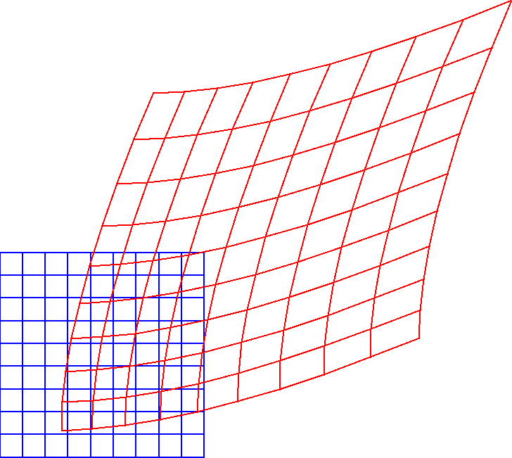

# Non-linear transformations

$\phi_m(\mathbf{x})$

# Non-linear transformations
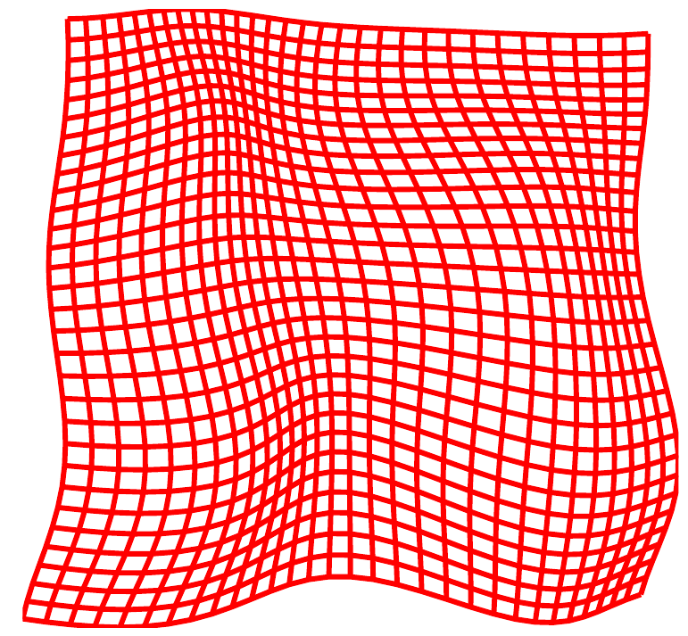

# Non-linear basis functions used in exercise this week

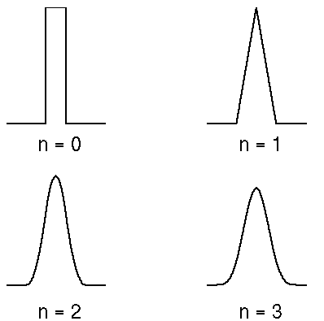

1-D: B-spline

&#x21e8;

2-D: "tensor B-spline"

# Non-linear basis functions used in exercise this week

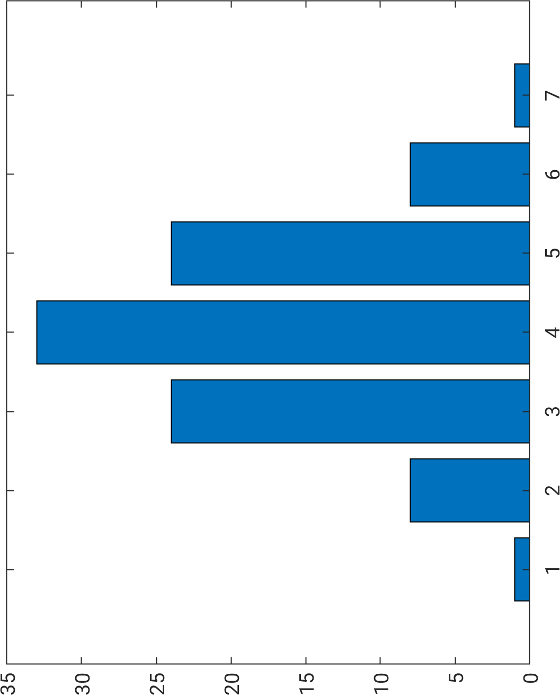

$\cdot$

$=$

$\begin{pmatrix} 1 \\ 8 \\ 24 \\ 33 \\ 24 \\ 8 \\ 1 \end{pmatrix} \cdot \begin{pmatrix}1 & 8 & 24 & 33 & 24 & 8 & 1\end{pmatrix}  = \begin{pmatrix}
1 \cdot 1 & 1 \cdot 8 & 1 \cdot 24 & 1 \cdot 33 & 1 \cdot 24 & 1 \cdot 8 & 1 \cdot 1\\
8 \cdot 1 & 8 \cdot 8 & 8 \cdot 24 & 8 \cdot 33 & 8 \cdot 24 & 8 \cdot 8 & 8 \cdot 1\\
24 \cdot 1 & 24 \cdot 8 & 24 \cdot 24 & 24 \cdot 33 & 24 \cdot 24 & 24 \cdot 8 & 24 \cdot 1\\
33 \cdot 1 & 33 \cdot 8 & 33 \cdot 24 & 33 \cdot 33 & 33 \cdot 24 & 33 \cdot 8 & 33 \cdot 1\\
24 \cdot 1 & 24 \cdot 8 & 24 \cdot 24 & 24 \cdot 33 & 24 \cdot 24 & 24 \cdot 8 & 24 \cdot 1\\
8 \cdot 1 & 8 \cdot 8 & 8 \cdot 24 & 8 \cdot 33 & 8 \cdot 24 & 8 \cdot 8 & 8 \cdot 1\\
1 \cdot 1 & 1 \cdot 8 & 1 \cdot 24 & 1 \cdot 33 & 1 \cdot 24 & 1 \cdot 8 & 1 \cdot 1\\
\end{pmatrix}$

# Non-linear basis functions used in exercise this week

Warp field: need one for each coordinate! 

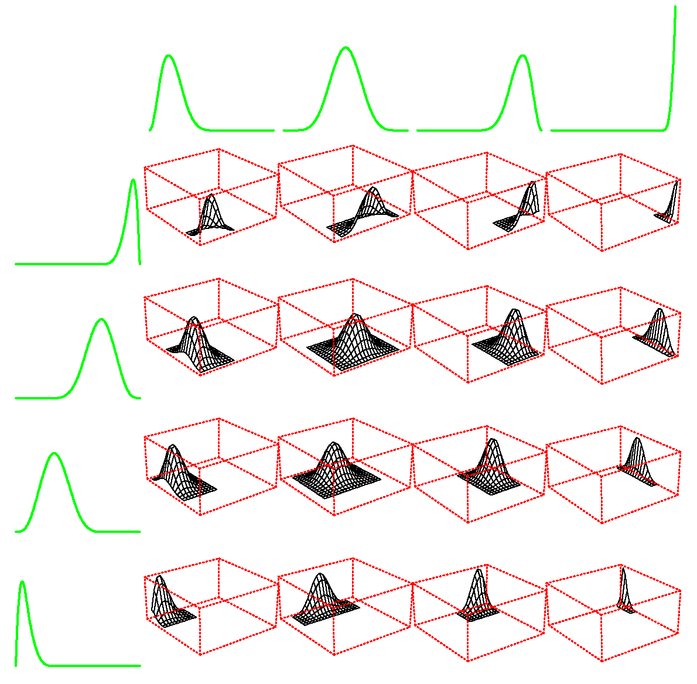

$\mathbf{y}^1 = \mathbf{x}^1 + \mathbf{Q\prime}\mathbf{w}_1$

$\mathbf{y}^2 = \mathbf{x}^2 + \mathbf{Q\prime}\mathbf{w}_2$

# Elements in image registration
- Geometrical transformation: $\quad \mathbf{y}(\mathbf{x};\mathbf{w}): \mathbb{R}^{2} \rightarrow \mathbb{R}^{2}$ or $\mathbb{R}^{3} \rightarrow \mathbb{R}^{3}$
- Similarity measure: $\quad\mathcal{D}(\mathbf{w})$
- Regularization: $\quad\mathcal{S}(\mathbf{w})$
- Optimization algorith: $\quad\mathcal{J}(\mathbf{w}) = \mathcal{D}(\mathbf{w}) + \alpha\mathcal{S}(\mathbf{w})$

# Optimization of image registration

 Optimize sum of squared differences 

 $\mathcal{D}_{\text{SSD}}(\mathbf{w}) = \frac{1}{2}\sum_{i\in\Omega}(\mathcal{T}(\mathbf{y}(\mathbf{x}_i;\mathbf{w})) - \mathcal{R}(\mathbf{x}_i))^2$ 

 

 New notation:  all coordinates simultaneously by stacking them 

 $\mathbf{\tilde{x}} = \begin{pmatrix} \mathbf{x}^1\\\mathbf{x}^2\\\mathbf{x}^3\end{pmatrix} \quad \mathbf{\tilde{y}} = \begin{pmatrix} \mathbf{y}^1\\\mathbf{y}^2\\\mathbf{y}^3\end{pmatrix} \quad \mathbf{\tilde{w}} = \begin{pmatrix} \mathbf{w}^1\\\mathbf{w}^2\\\mathbf{w}^3\end{pmatrix}$ 

&#x21e8;

$\mathbf{\tilde{y}} = \mathbf{\tilde{x}} + \begin{pmatrix}\mathbf{Q\prime} & 0 & 0\\ 0 & \mathbf{Q\prime} & 0\\ 0 & 0 & \mathbf{Q\prime} \end{pmatrix}\mathbf{w} = \mathbf{\tilde{x}} + \mathbf{Q}\mathbf{w}$ 

# Optimization of image registration

 More new notation: 

 

$\mathcal{R}(\mathbf{\tilde{x}})$: vector of all reference image values  
$\mathcal{T}(\mathbf{\tilde{y}})$: vector of corresponding template image values 

 

&#x21e8;

$\begin{align}\mathcal{D}_{\text{SSD}}(\mathbf{w}) &= \frac{1}{2}\sum_{i\in\Omega}(\mathcal{T}(\mathbf{y}(\mathbf{x}_i;\mathbf{w})) - \mathcal{R}(\mathbf{x}_i))^2\\
&= \frac{1}{2}\|\mathcal{T}(\mathbf{\tilde{y}}) - \mathcal{R}(\mathbf{\tilde{x}})\|^2\end{align}$ 

# Linearization

For a small change $\mathbf{s}$ to the current parameter estimate $\mathbf{w}$ we have (linearization): 
 

$\begin{align}\mathcal{D}_{\text{SSD}}(\mathbf{w} + \mathbf{s}) &= \frac{1}{2}\|\mathcal{T}(\mathbf{\tilde{x}} + \mathbf{Q}(\mathbf{w} + \mathbf{s})) - \mathcal{R}(\mathbf{\tilde{x}})\|^2\\ &\approx  \frac{1}{2}\|\mathcal{T}(\mathbf{\tilde{x}} + \mathbf{Q}(\mathbf{w})) + \nabla\mathcal{T}(\mathbf{\tilde{x}} + \mathbf{Q}\mathbf{w})\mathbf{Q}\mathbf{s} - \mathcal{R}(\mathbf{\tilde{x}})\|^2 \end{align}$ 

 

with $\nabla\mathcal{T}(\mathbf{\tilde{x}} + \mathbf{Q}\mathbf{w}) = (\mathbf{G}_{1}\quad\mathbf{G}_{2}\quad\mathbf{G}_{3})$ 

and $\mathbf{G}_k = \text{diag}(\left.\frac{\partial\mathcal{T}}{\partial y^{k}}\right|_{\mathbf{y}_1}, \dots, \left.\frac{\partial\mathcal{T}}{\partial y^{k}}\right|_{\mathbf{y}_N})$ 

# Linearization (baby version)

1D, only 1 pixel, only translation ($y=x+t$) 

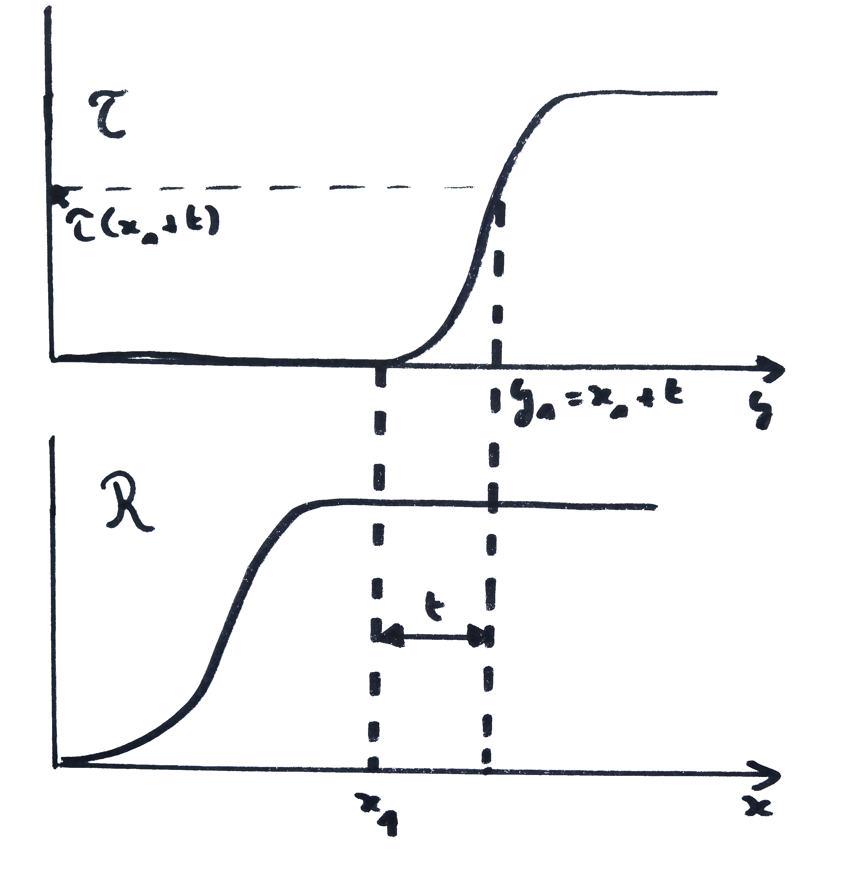

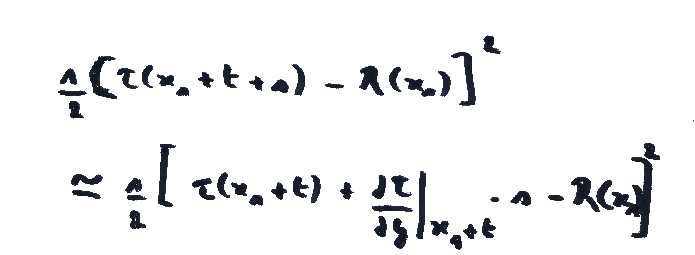

# Optimization of image registration

Gauss-Newton optimization: search for change $\mathbf{s}$ that minimizes 

$\mathcal{D}_{\text{SSD}}(\mathbf{w} + \mathbf{s}) \approx \frac{1}{2}\|\mathcal{T}(\mathbf{\tilde{x}} + \mathbf{Q}\mathbf{w}) + \nabla\mathcal{T}(\mathbf{\tilde{x}} + \mathbf{Q}\mathbf{w})\mathbf{Q}\mathbf{s} - \mathcal{R}(\mathbf{\tilde{x}}) \|^2$

 Is standard least-squares fit!

&#x21ba;

 solve $(\mathbf{J}^{T}\mathbf{J})\mathbf{s} = \mathbf{J}^T(\mathcal{R}(\mathbf{\tilde{x}}) - \mathcal{T}(\mathbf{\tilde{x}} + \mathbf{Q}\mathbf{w}))$
 
 where $\mathbf{J} = \nabla\mathcal{T}(\mathbf{\tilde{x}} + \mathbf{Q}\mathbf{w})\mathbf{Q}$

When done, update current parameter estimate $\mathbf{w}\coloneqq\mathbf{w} + \mathbf{s}$

# Optimization of image registration

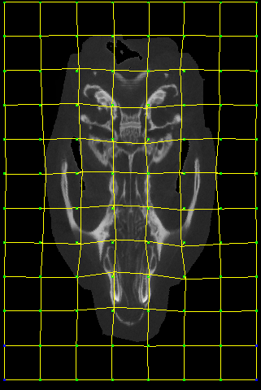
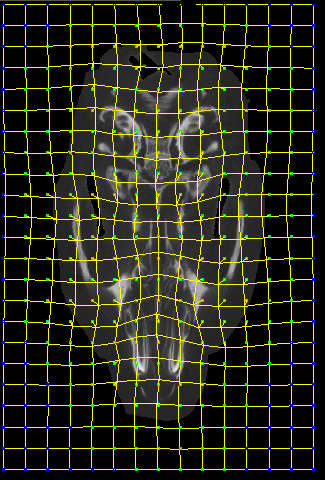
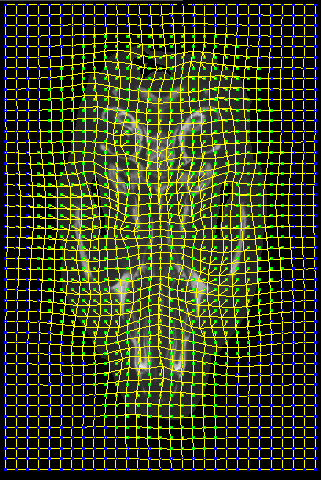

